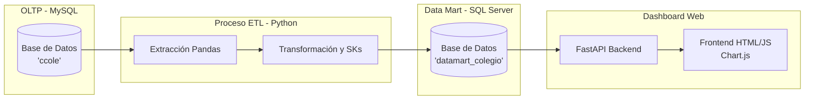

# 🚀 Data Mart y Dashboard BI de Rendimiento Académico

Este proyecto es una solución integral de Inteligencia de Negocios (BI) diseñada para el análisis del rendimiento y asistencia de estudiantes. Abarca desde la generación de datos transaccionales, pasando por un proceso ETL robusto, hasta la visualización en tiempo real mediante un Dashboard Web interactivo.

---

## 📐 Arquitectura del Sistema

La solución implementa el ciclo de vida completo de los datos:

---

## 🛠️ Componentes Principales

### 1. Generador de Datos (`generador_colegio.py`)
Script en Python que actúa como el sistema transaccional (OLTP). Borra registros antiguos y genera miles de datos estructurados y realistas (nombres, cursos, notas, asistencias) simulando la operatividad diaria del colegio.

### 2. Proceso ETL (`ETL_colegio-mejora.py` / `ETL_colegio.py`)
El motor de integración de datos construido con **Pandas** y **SQLAlchemy**.
* **Extracción:** Obtiene datos del origen transaccional en MySQL.
* **Transformación:** Normaliza textos, genera la Dimensión Tiempo automáticamente, pre-calcula métricas complejas (agrupación de asistencias) y asigna Llaves Subrogadas (SK).
* **Carga:** Vacía limpiamente el SQL Server (manejando las Foreign Keys) e inyecta cientos de miles de registros analíticos en el Esquema de Estrella.

### 3. Almacén de Datos (`Datamart_colegio.sql`)
Un script T-SQL que construye un **Modelo en Estrella (Star Schema)** en SQL Server. Incluye las dimensiones (`DimEstudiante`, `DimCurso`, `DimProfesor`, etc.), la tabla de hechos (`HechoRendimientoAcademico`) y una vista analítica indexada (`vw_RendimientoAcademico`) optimizada para lecturas ultra rápidas.

### 4. Dashboard Web (`api.py` + `public/`)
* **Backend:** Desarrollado en **FastAPI**, expone los endpoints que consultan el Data Mart. Incluye optimizaciones SQL para consultas ultrarrápidas y uso de *Server-Sent Events (SSE)* para transmitir el log del ETL en vivo.
* **Frontend:** Interfaz moderna con HTML5, CSS Variables y JavaScript puro. Utiliza **Chart.js** para la visualización de KPIs (Promedios, Asistencias Totales) y gráficas dinámicas de rendimiento.

---

## 💻 Tecnologías Utilizadas

* **Base de Datos:** MySQL (Origen), Microsoft SQL Server (Data Mart)
* **Backend / ETL:** Python 3.8+, Pandas, NumPy, SQLAlchemy, FastAPI, Uvicorn
* **Frontend:** HTML5, CSS3, Vanilla JavaScript, Chart.js, FontAwesome

---

## 📂 Estructura del Repositorio

| Archivo / Carpeta | Descripción |
| :--- | :--- |
| **`public/`** | Carpeta con los estáticos del Dashboard (`index.html`, `style.css`, `main.js`). |
| **`api.py`** | Servidor FastAPI que expone los datos al Dashboard. |
| **`generador_colegio.py`** | Inyector de datos realistas a MySQL. |
| **`ETL_colegio-mejora.py`** | Versión optimizada del script ETL (Manejo eficiente de asistencias y cruces). |
| **`Datamart_colegio.sql`** | Estructura DDL para SQL Server. |
| **`MANUAL_INSTALACION.md`** | Guía paso a paso para desplegar el proyecto. |

---

## 🚀 Despliegue Rápido
Para instrucciones detalladas sobre cómo clonar, instalar dependencias y levantar el servidor web, consulta el archivo [MANUAL_INSTALACION.md](MANUAL_INSTALACION.md).
