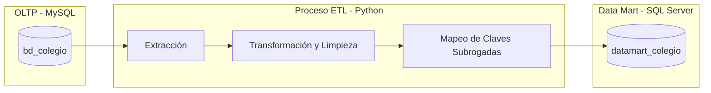
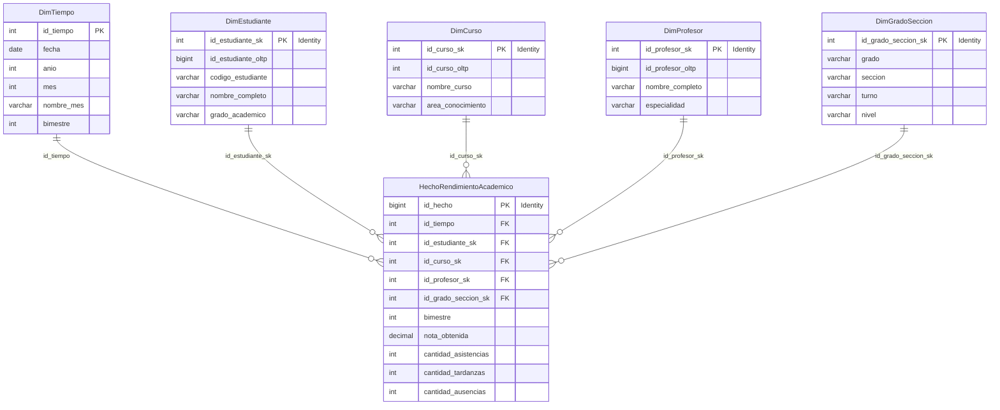

# Data Mart de Rendimiento Académico Escolar (BI/ETL)

Este proyecto implementa una solución completa de Inteligencia de Negocios (BI) para analizar el rendimiento académico de estudiantes en un colegio. Contempla la extracción de datos desde una base de datos transaccional (OLTP) en **MySQL**, un proceso de transformación y carga (ETL) desarrollado en **Python**, y un almacén de datos (Data Mart) con un diseño multidimensional en estrella (Star Schema) alojado en **SQL Server**.

---

## 📐 Arquitectura de la Solución

El flujo de datos de la solución sigue el ciclo de vida clásico de Business Intelligence:



---

## 🗄️ 1. Modelo de Origen (OLTP - MySQL)

La base de datos origen, `bd_colegio` (cuyo volcado inicial y procedimiento de generación de datos masivos se encuentra en el archivo `ccole (2).sql`), representa el sistema transaccional del colegio. 

### Tablas Fuente del Sistema
*   **`personas`**: Información básica de individuos (nombres, apellidos, DNI, fecha de nacimiento).
*   **`estudiantes`**: Relación de alumnos, vinculados a una persona, con su código institucional.
*   **`profesores`**: Relación de docentes y sus especialidades.
*   **`grados`**: Niveles y grados académicos (ej. Primaria, Secundaria, 1er Grado, etc.).
*   **`secciones`**: Secciones dentro de un grado (letra, turno, grado_id).
*   **`cursos`**: Asignaturas impartidas y su respectiva área de conocimiento.
*   **`matriculas`**: Registro de estudiantes matriculados en una sección y año específico.
*   **`notas`**: Calificaciones registradas para cada estudiante en sus respectivos cursos.
*   **`asistencias_estudiantes`**: Registro detallado de asistencias diarias (estado: Presente, Tarde, Falta).

---

## 📊 2. Modelo de Destino (Data Mart - SQL Server)

El Data Mart está alojado en SQL Server bajo la base de datos `datamart_colegio`. Su diseño utiliza un **Modelo en Estrella (Star Schema)** optimizado para consultas analíticas rápidas y agregaciones. El script de creación se encuentra en `Datamart_colegio.sql`.

### Esquema del Data Mart



### Vista de Consulta Analítica Integrada
Para facilitar el consumo de los datos por herramientas de visualización (como Power BI, Excel o Reporting Services), se incluye la vista de conveniencia **`vw_RendimientoAcademico`**, que realiza los cruzamientos necesarios y expone el estado académico (Aprobado/Desaprobado) y las métricas limpias.

---

## ⚙️ 3. Pipeline ETL (Python)

El proceso de extracción, transformación y carga está implementado en `ETL_colegio.py` utilizando `pandas` y `SQLAlchemy`.

### Flujo del Proceso:
1.  **Extracción (Extract):** Lee las tablas del origen MySQL de forma simultánea a través de consultas SQL cargadas en DataFrames de Pandas.
2.  **Transformación (Transform):**
    *   **Limpieza:** Relleno de nulos (ej. áreas de conocimiento huérfanas como 'GENERAL').
    *   **Conformación de Dimensiones:** Fusión de tablas para obtener nombres completos y estructuras estandarizadas de grados y profesores.
    *   **Dimensión de Tiempo:** Generación automática de un calendario que abarca desde el año 2020 al 2026.
    *   **Asignación de Claves Subrogadas (Surrogate Keys):** En lugar de utilizar las claves del sistema OLTP directamente, se cargan primero las dimensiones y luego se re-importan sus nuevos IDs generados por SQL Server (`IDENTITY`) para mapearlos a los hechos.
    *   **Cálculo de Métricas:** Agrupa y calcula dinámicamente las asistencias, tardanzas e inasistencias acumuladas por matrícula a partir de los registros individuales de asistencia diaria.
3.  **Carga (Load):**
    *   Limpia la base de datos de destino en SQL Server mediante comandos `DELETE` truncando hechos y dimensiones (para asegurar un reinicio limpio).
    *   Carga las dimensiones de manera secuencial para cumplir con las restricciones de claves foráneas.
    *   Carga la tabla de hechos final `HechoRendimientoAcademico`.

---

## 🛠️ 4. Guía de Configuración y Ejecución

### Requisitos Previos

Asegúrate de contar con los siguientes servicios y bibliotecas instalados:

*   **Bases de Datos:**
    *   MySQL Server (MariaDB / phpMyAdmin)
    *   Microsoft SQL Server
    *   Driver de SQL Server: `ODBC Driver 17 for SQL Server`
*   **Entorno Python 3.8+:**
    *   `pandas`
    *   `numpy`
    *   `pymysql`
    *   `pyodbc`
    *   `sqlalchemy`

### Paso 1: Importar Base de Datos OLTP en MySQL
1.  Abre tu administrador de MySQL (phpMyAdmin, DBeaver, MySQL Workbench, etc.).
2.  Crea la base de datos `bd_colegio`.
3.  Importa y ejecuta el script `ccole (2).sql` para estructurar y poblar la base de datos con datos de muestra y masivos.

### Paso 2: Crear Estructuras del Data Mart en SQL Server
1.  Abre SQL Server Management Studio (SSMS) o Azure Data Studio.
2.  Ejecuta el script `Datamart_colegio.sql`. Esto creará la base de datos `datamart_colegio`, las tablas de dimensiones, hechos, claves foráneas, índices de rendimiento y la vista analítica.

### Paso 3: Configurar Credenciales en Python
En el archivo `ETL_colegio.py`, ajusta los diccionarios de conexión con tus credenciales de base de datos locales si difieren de las estándar:

```python
# Configuración MySQL (Origen)
MYSQL_CONFIG = {
    'host': 'localhost',
    'user': 'root',
    'password': 'TU_PASSWORD_AQUI',
    'database': 'bd_colegio'
}

# Configuración SQL Server (Destino)
SQLSERVER_CONFIG = 'mssql+pyodbc://@localhost/datamart_colegio?driver=ODBC+Driver+17+for+SQL+Server'
```

### Paso 4: Ejecutar el ETL
Ejecuta el script de Python desde tu terminal:

```bash
python ETL_colegio.py
```

El script imprimirá en consola el progreso detallado de cada fase:
1.  Cantidad de registros extraídos por tabla de MySQL.
2.  Resultados de la transformación y creación de dimensiones intermedias.
3.  Confirmación del truncado y carga de dimensiones en SQL Server.
4.  Resultados del mapeo de llaves subrogadas.
5.  Carga de la tabla de hechos.
6.  Una verificación final indicando el conteo final de registros en cada tabla y un muestreo rápido de datos de la vista.

---

## 📂 Estructura del Repositorio

A continuación se detalla el contenido de los archivos clave en este repositorio:

| Archivo | Tipo / Extensión | Descripción |
| :--- | :--- | :--- |
| **`ETL_colegio.py`** | Script Python | Código principal del pipeline ETL (Extracción, Transformación y Carga). |
| **`Datamart_colegio.sql`** | Script T-SQL | Estructura DDL de SQL Server (Tablas del Data Mart, Índices, FKs y Vista Analítica). |
| **`ccole (2).sql`** | Volcado MySQL | Respaldo del origen OLTP (`bd_colegio`) con datos de prueba pre-generados. |
| **`40179e1d-a922-413c-9036-42f10e777379.jfif`** | Imagen | Recurso visual (ej. Diagrama Entidad-Relación o captura de panel de control). |
| **`f3553eb5-1ef3-41a0-9deb-4d42bb51b9ea.jfif`** | Imagen | Recurso visual de apoyo del proyecto. |

---

## 🎯 Caso de Uso Analítico y Rendimiento

El modelo multidimensional implementa índices adicionales en la tabla de hechos sobre columnas clave como `nota_obtenida` y `cantidad_ausencias` para maximizar la velocidad de respuesta en consultas de reportes gerenciales, tales como:
*   Identificación temprana de estudiantes en riesgo de deserción por inasistencias o bajas calificaciones.
*   Comparativa de promedios de notas por bimestre, turno y área de conocimiento.
*   Evaluación de la carga docente e impacto pedagógico por curso/profesor.
